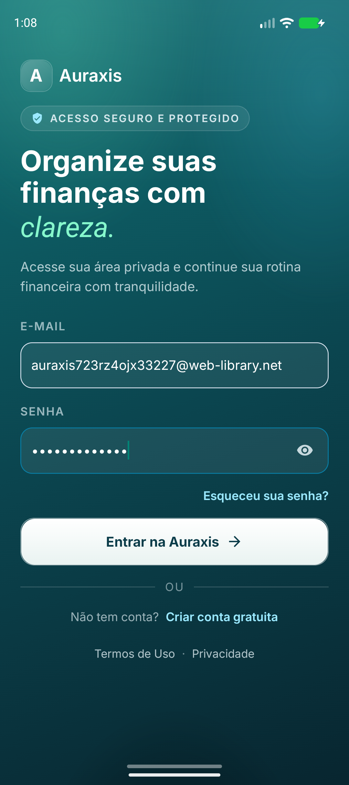
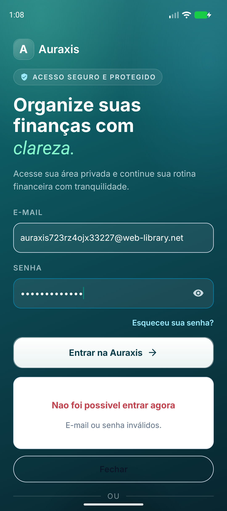
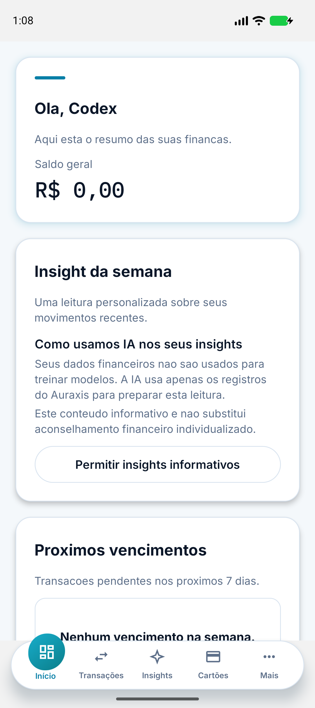

# Incidente mobile: login bloqueado pela rotação TLS

**Data:** 2026-07-24

**Issue:** [#723](https://github.com/italofelipe/auraxis-app/issues/723)

**Impacto:** login e demais chamadas da API indisponíveis em builds nativos
iOS e Android afetados; Web permaneceu operacional.

## Sintoma

Uma conta válida autenticava na Web, mas o app instalado exibia imediatamente
`Não foi possível entrar agora`. A requisição era bloqueada no handshake TLS,
antes de `/auth/login` chegar à API. Por isso repetir as mesmas credenciais ou
alterar o payload não poderia corrigir o problema.

## Evidências

- `https://api.auraxis.com.br/healthz` respondia HTTP 200.
- Payload, endpoint e cabeçalho `X-API-Contract: 2` eram equivalentes na Web e
  no App.
- O certificado público havia sido renovado em 2026-07-18.
- A cadeia servida em 2026-07-24 continha:

| Certificado | SPKI SHA-256 |
|---|---|
| Leaf `api.auraxis.com.br` | `sha256/ll8r/Juoowyh1V2qUhOGv79vQkRFWb014Jyh4T3NuQ8=` |
| Let's Encrypt `YE2` | `sha256/s/tdAOmUzd8syaTuqfgGvFcn6DzA5Cmb+Vby1ST+U3Y=` |
| `ISRG Root YE` | `sha256/sCkq5UWXjg+7mKu9lMhhYF5bGLsy7VI/UNW3tccdR7w=` |

- O binário declarava o antigo leaf
  `sha256/6ZqZa5LRfTimLYEkGrZ9Pja4ku36AtNGVJ9NbD13GgI=` e a antiga CA
  `sha256/y7xVm0TVJNahMr2sZydE2jQH8SquXV9yLF9seROHHHU=`. Nenhum dos dois
  aparecia na cadeia atual.
- No iOS, leaf e CA estavam configurados simultaneamente. A política da Apple
  avalia as categorias configuradas, portanto a renovação do leaf invalidou o
  trust nativo.
- No Android, `expo.android.networkSecurityConfig` existia no JSON, mas o Expo
  prebuild não copiava o XML nem adicionava `android:networkSecurityConfig` ao
  manifest gerado. A intenção de segurança estava documentada, mas não conectada
  ao aplicativo nativo.

## Causa raiz

A estratégia dependia de certificados de curta duração e não possuía um gate
que comparasse os pins versionados com a cadeia pública antes do build. A
renovação TLS tornou o binário iOS incapaz de confiar na API. Em paralelo, a
configuração Android usava uma propriedade sem integração efetiva no prebuild,
criando divergência silenciosa entre as plataformas.

O texto genérico de erro agravou o diagnóstico: uma falha de transporte parecia
falha de credenciais.

Durante o E2E do binário corrigido foi encontrada uma segunda regressão no
handoff: `/ai/insights/spending-patterns/latest` respondia 403 para uma conta
sem esse entitlement, e o interceptor global tratava qualquer 403 como token
inválido. A sessão recém-criada era apagada apesar do login ter retornado 200.
A Web já preservava a sessão nesse cenário e tratava o 403 como falta de
permissão do recurso.

## Correção

1. Remoção de `NSPinnedLeafIdentities` no iOS.
2. Adoção dos dois CA-SPKIs atuais (`YE2` e `ISRG Root YE`) nas duas
   plataformas.
3. Config plugin Expo que:
   - injeta `android:networkSecurityConfig="@xml/network_security_config"`;
   - mantém `android:usesCleartextTraffic="false"`;
   - copia o XML canônico para o resource Android gerado.
4. Verificador `npm run ssl-pinning:check`, que falha quando:
   - um leaf volta a ser configurado no iOS;
   - iOS e Android divergem ou têm menos de dois pins;
   - a expiração Android fica a menos de 30 dias;
   - qualquer pin não aparece na cadeia TLS ao vivo.
5. Taxonomia de erro do login:
   - HTTP 401 → `E-mail ou senha inválidos.`;
   - falha DNS/rede/TLS → descrição específica de conectividade.
6. Preservação da sessão em 403 de recursos opcionais; somente 401 invalida no
   interceptor global. A revalidação explícita de bootstrap/assinatura continua
   podendo encerrar a sessão em 401/403.
7. E2E Maestro sem credenciais no repositório, cobrindo senha mascarada,
   credencial inválida e login válido até o Dashboard.

## Evidência visual E2E

As imagens abaixo são geradas pelo fluxo `.maestro/01_login.yaml` a partir do
build Android release da correção.

### Senha mascarada antes do envio



### Credencial inválida recebe feedback seguro



### Login válido abre a área privada



## Validação obrigatória para rotações futuras

```bash
npm run ssl-pinning:check
npx expo prebuild --platform android --clean --no-install
npm run quality-check
```

Depois do build, executar o Maestro e o smoke MITM em iOS e Android. Uma mudança
de pinning exige release nativo para as lojas; OTA não modifica a política do
binário já instalado.

## Risco residual e acompanhamento

- CA pinning reduz a frequência de incidentes por renovação de leaf, mas exige
  atualização quando a cadeia da CA mudar.
- O check ao vivo depende de rede e deve falhar fechado no processo de release.
- O build local Android foi validado com upload de sourcemaps Sentry desativado
  porque as credenciais de upload pertencem ao ambiente de CI; isso não altera
  bundle, manifest ou política TLS.
- O smoke desta correção usa Android emulado. O mesmo binário/política deve ser
  confirmado em TestFlight e Google Play internal antes da promoção pública.

## Referências

- [Apple — NSPinnedDomains](https://developer.apple.com/documentation/bundleresources/information-property-list/nsapptransportsecurity/nspinneddomains)
- [Android — Network Security Configuration](https://developer.android.com/privacy-and-security/security-config)
- [Runbook de rotação](../runbooks/ssl-pinning-rotation.md)
